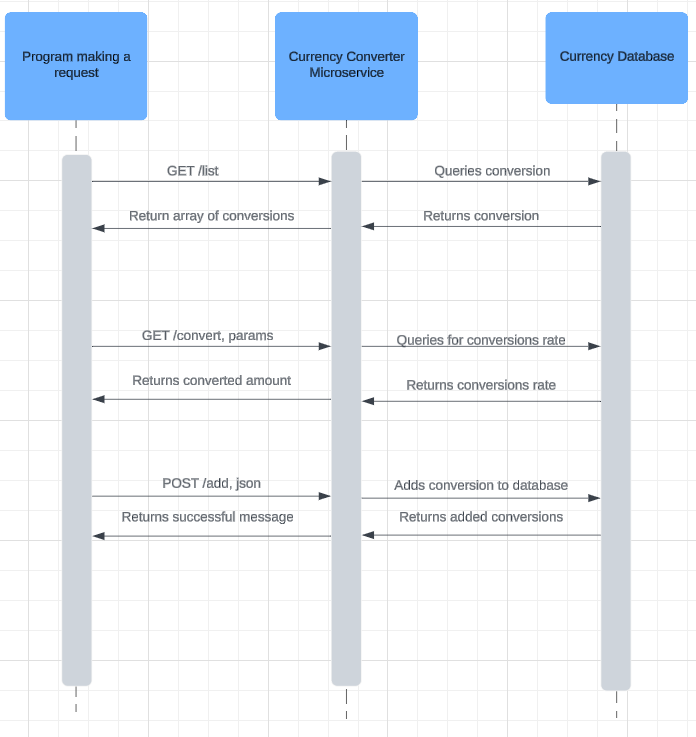

# Microservice A: Currency Converter

## Setup
1. Clone the repo.
2. Install and Run PostgreSQL locally on computer.
3. Create a database called `currency_db`
4. Update `main.py` file using your PostgreSQL's credentials for all `user="YourUsername"` and `password="YourPassword"`
5. Run `pip install Flask psycopg2-binary` into terminal to install neccessary packages.
6. Run `python main.py` to start microservice.

## Routes
| Route | Description | Example Call | Example Return Response |
| ----- | ----------- | ------------ | ----------------------- |
| GET `/list` | Return an array of conversions | GET `/list` | `[{"from_currency": "USD", "rate": 0.85,"to_currency": "EUR"}, ...]` |
| GET `/convert` | Convert an amount in one currency to another currency | GET `/convert` with params `{"from_currency": USD, "to_currency": EUR, "amount": 100}` | `{"amount": 100,"converted_amount": 85,"from_currency":"USD", "rate": 0.85, "to_currency": "EUR"}` |
| POST `/add` | Add a new conversion  | POST `/add` with json `{"from_currency": from_curr, "to_currency": to_curr,  "rate": rate}` | `{"message": "Conversion added successfully.", "from_currency": from_currency, "to_currency": to_currency, "rate": rate}` |

## Requesting and Receiving Data
To programmatically REQUEST data from the microservice one way is to use Python `request` library to send request. Either `requests.get()` or `request.post()`

To programmatically RECEIVE data from the microservice is to use `response.json()`

Examples Calls for each endpoint:

## GET `/list`: 

Example Request Call: `response = requests.get("http://localhost:5000/list")`

Example Receive Call: `response.json()` to receive the following JSON object:
`[
{
"from_currency": "USD",
"rate": 0.85,
"to_currency": "EUR"
},
{
"from_currency": "EUR",
"rate": 1.18,
"to_currency": "USD"
},
{
"from_currency": "USD",
"rate": 1.41,
"to_currency": "CAD"
},
{
"from_currency": "CAD",
"rate": 0.71,
"to_currency": "USD"
}
]`

## GET `/convert`: 
This requires `from_currency`, `to_currency`, and `amount` parameters.

Example Request Call: `params = {
        "from_currency": USD,
        "to_currency": EUR,
        "amount": 100
    }`
`response = requests.get("http://localhost:5000/convert", params=params)`

Example Receive Call: `response.json()` to receive the following JSON object:
`{
"amount": 100,
"converted_amount": 85,
"from_currency": "USD",
"rate": 0.85,
"to_currency": "EUR"
}`

## GET `/add`:
 This requires `from_currency`, `to_currency`, and `rate` JSON object

Example Request Call: `data = {
        "from_currency": USD,
        "to_currency": CAD,
        "rate": 1.40
    }`
`requests.post("http://localhost:5000/add", json=data)`

Example Receive Call: `response.json()` to receive the following JSON object: `{
        "message": "Conversion added successfully.",
        "from_currency": USD,
        "to_currency": CAD,
        "rate": 1.40
    }`

## UML Diagram
